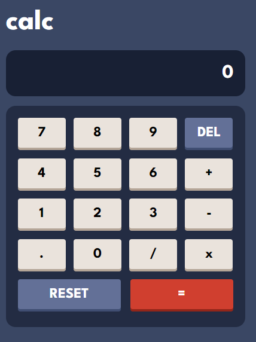

# Frontend Mentor - Calculator app solution

This is a solution to the [Calculator app challenge on Frontend Mentor](https://www.frontendmentor.io/challenges/calculator-app-9lteq5N29). Frontend Mentor challenges help you improve your coding skills by building realistic projects.

## Table of contents

- [Overview](#overview)
  - [The challenge](#the-challenge)
  - [Screenshot](#screenshot)
  - [Links](#links)
- [My process](#my-process)
  - [Built with](#built-with)
  - [What I learned](#what-i-learned)
  - [Continued development](#continued-development)
- [Author](#author)

## Overview

### The challenge

Users should be able to:

- See the size of the elements adjust based on their device's screen size
- Perform mathmatical operations like addition, subtraction, multiplication, and division
- Adjust the color theme based on their preference
- **Bonus**: Have their initial theme preference checked using `prefers-color-scheme` and have any additional changes saved in the browser

### Screenshot

### Links

- Live Site URL: [Calculator](https://dev-jp-calculator-app.netlify.app)

## My process

### Built with

- Flexbox
- CSS Grid
- Mobile-first workflow
- [Jquery](https://jquery.com/) - JS library

### What I learned

I learned how to effectively use javascript logic to do the calculations using switch statements.

### Continued development

I plan on learning optimized ways om doing useful things in JavaScript for better optimization.

### Useful resources

## Author

- linkedin - [@JpJonker](https://www.linkedin.com/in/jp-jonker-387078225/)
- Website - [Portfolio](https://devjp.website)
- Frontend Mentor - [@JpJonker](https://www.frontendmentor.io/profile/JpJonker)
